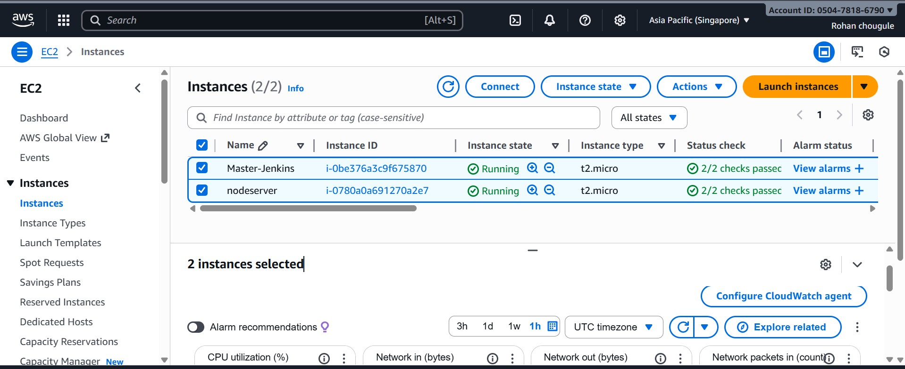
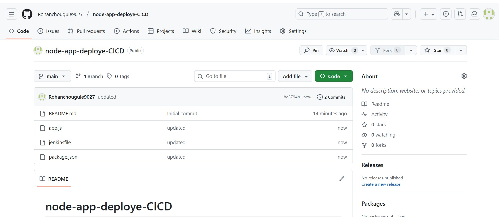
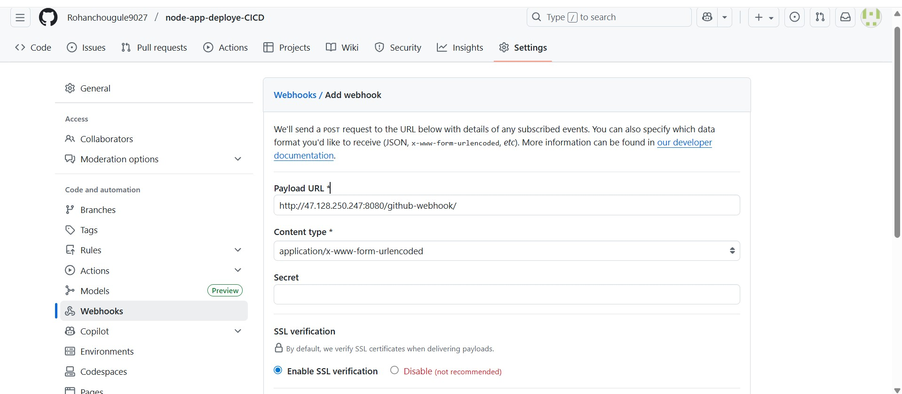
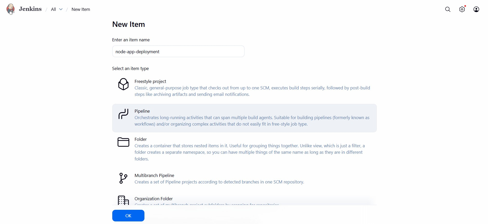
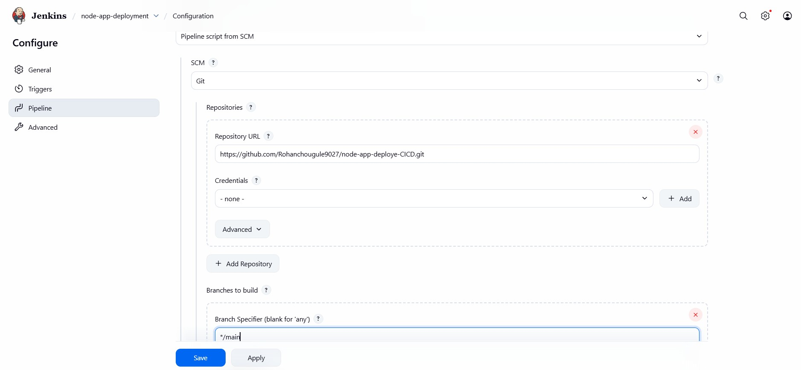
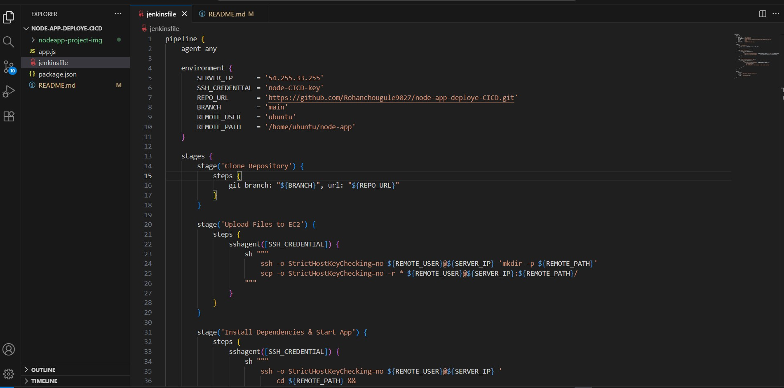
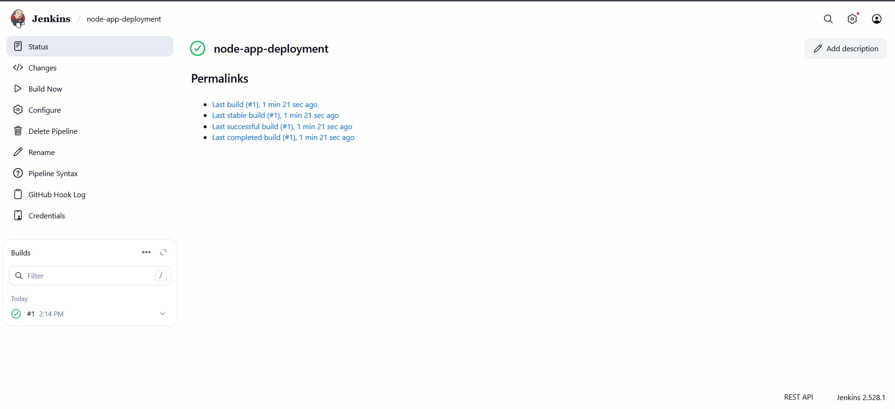
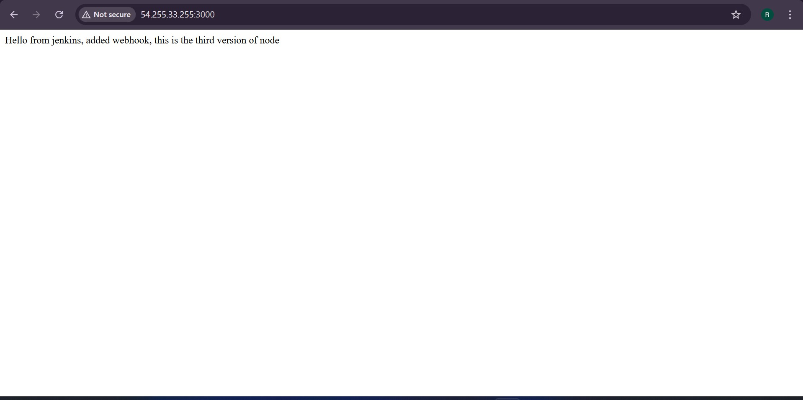

# Node.js App Deployment CI/CD Pipeline
## Project Overview
**🌐 Node.js App — Automated CI/CD Pipeline Using Jenkins + GitHub Webhooks**   
This project implements a complete CI/CD pipeline for a Node.js application deployment using Jenkins, AWS EC2, and GitHub integration. The pipeline automates the build, test, and deployment process whenever code changes are pushed to the repository.

---

## Architecture Diagram


---

### What This Project Does
* Automates the deployment of a Node.js application using Jenkins CI/CD.
* Integrates GitHub Webhooks to automatically trigger builds when new code is pushed.
* Pulls the latest source code from the GitHub repository.
* Installs all required Node.js dependencies automatically.
* Builds and tests the application to ensure code quality.
* Deploys the updated application to the target server without manual steps.
* Ensures continuous integration and continuous delivery (CI/CD) for faster, reliable updates.
* Provides a fully automated workflow — from code commit to live deployment.
### Prerequisites
* GitHub repository for your app.
* Jenkins server(Ubuntu) reachable by your Git host and target servers
* Jenkins plugins (at minimum):
     * Pipeline
     * Git
    * GitHub
     * SSH Agent (for SSH-based deploys)
* Target EC2 server(node) with SSH access
* Node.js application source code hosted on a Git repository (e.g., GitHub).

## Pipeline Workflow
1. Code Commit → Developer pushes changes to GitHub
2. Webhook Trigger → GitHub notifies Jenkins via webhook
3. Build Execution → Jenkins pulls latest code and runs pipeline
4. Deployment → Application deployed to AWS EC2 instances
5. Verification → Health checks and status monitoring

## Step-1: Launch EC2s
Lauch two EC2s in same VPC(default)
* Jenkins Server
     * Add port 8080 in Security Group
* Target Server
     * Add port 22 & 3000 in security Group
     * install nodejs, npm and pm2 (manually)  

``` 
sudo apt update             
sudo apt install nodejs npm -y
sudo npm install -g pm2
```

---

## Step-2: Create Repository on GitHub
* Create a repository on Github     
    * Name: `node-app-deploye-CICD`  
   *  Branch: `main`


---
* Add Webhooks
   * Payload URL : `http://<Jenkin-Server-PUBLIC-IP>:8080/github-webhook/`


 ---
## Step-3: Add Credentials
* Create New Credentails
    * Scope: `Global`
    * id: `node-CICD-key`
    * description: `node-CICD-key`
    * username: `ubuntu`
    * private key: `Your-Private-Key`


---
## Step-4: Create Job
* name: `node-app-deployement`
* Job-type: `Pipeline`



* Enable Trigger: GitHub hook trigger for GITScm polling
* Defination: Pipeline script from SCM
* SCM: Git
* Repository: `https://github.com/Rohanchougule9027/node-app-deploye-CICD.git` 
* Branch: main
* Script Path: `Your-jenkinsfile-name`


---

## Step-5: Write Jenkinsfile

Replace:`SERVER_IP`, `SSH_CREDENTIAL`, `REPO_URL`, and `REMOTE_PATH` with your actual values.


---


## Step-6: Push code and Jenkins file to Repository
Now we pushed code to GitHub, a webhook instantly notifies the Jenkins server. Jenkins then automatically pulls the latest code, installs dependencies, runs tests, builds the application, and deploys it to the target server
```
git init
git add .
git commit -m ""
git push -u origin main
```



---
## Step-7: Browse Application on browser
open browser and enter `http://<Node-Server-Public-Ip>:3000`


## Conclusion
This CI/CD setup delivers a fully automated, production-ready Node.js deployment:

✅ Faster releases
✅ No manual deployment errors
✅ Continuous & reliable delivery
✅ Real DevOps workflow

It is a powerful example of how Jenkins, GitHub, PM2, and EC2 combine to streamline modern software delivery pipelines.

---
